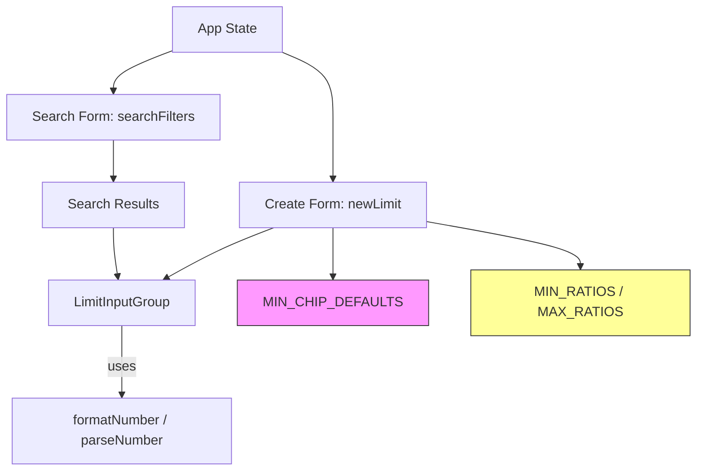

# Bet Limit Configuration (Baccarat) — System Analysis

此文件根據 `index.html` 的程式碼撰寫，目的在於提供系統分析、設計重點、資料流程、以及如何在本地環境測試與驗證。

**目錄**
- 簡介
- 主要功能與工作流程
- 前端資料模型
- 主要元件與責任
- 驗證規則與商業邏輯
- UI 行為（狀態機）
- 相依性圖（Mermaid）
- 本地測試與驗證步驟
- 潛在改善建議


## 簡介

`index.html` 為單一檔案的前端管理介面（使用純 React + Babel 在瀏覽器執行），用於建立與修改 Baccarat 的 Bet Limit 設定。UI 為管理員操作介面，提供搜尋、編輯與建立新 Bet Limit 的功能。

## 主要功能與工作流程

- Search & Modify：根據 Website（必要） 或 ID（替代）以及可選的 Currency 查詢現有設定，頁面顯示可編輯的 Limit Matrix，並能儲存修改。
- Create New：管理員可以選擇 Website、Currency，輸入（或自動計算）Base Min/Base Max，套用比率後自動填入各個投注類別的 Min/Max，最後儲存為新的 Bet Limit 設定。

## 前端資料模型

- Global constants
  - `WEBSITES`: 可用網站清單
  - `CURRENCIES`: 可用貨幣清單
  - `MIN_CHIP_DEFAULTS`: 每種貨幣對應的最低籌碼（模擬後端）
  - `MIN_RATIOS` / `MAX_RATIOS`: 各投注類型的比率，用以從 Base Min/Base Max 計算實際值

- State（React useState）
  - `data`: 系統目前的 Bet Limits 列表（模擬後端資料）
  - `newLimit`: 建立新設定時使用的 model，包含 `website`, `currency`, `minChip`, `limits` 等
  - `baseMin`, `baseMax`: Quick Auto-Calculation 的輸入
  - Search 相關：`searchFilters`, `searchResults`, `hasSearched`


## 主要元件與責任

- `LimitInputGroup`：可重用的 UI 元件，負責顯示並編輯單一投注類型的 Min/Max。參數包括
  - `title`, `minVal`, `maxVal`, `onMinChange`, `onMaxChange`
  - `isMain`：標示主要欄位（Banker/Player）以不同樣式
  - `minChipLimit`：用以驗證 Min 是否小於 MinChip
  - `minRatio`, `maxRatio`：顯示於 UI 的比率數值
  - `baseMinLimit`：用於顯示或比較 Base Min 產生的最小值
  - `disabled`：當 `website` 或 `currency` 未選擇時，切換為唯讀（新增的行為）

- `App`：主應用，管理分頁（Search / Create）、狀態、表單驗證、建立與儲存等流程。


## 驗證規則與商業邏輯

- 建立（Create）
  - `Website` 與 `Currency` 為必填（註：程式會阻擋儲存並顯示錯誤訊息）。
  - `minChip`：當選擇 Currency 時從 `MIN_CHIP_DEFAULTS` 取得；若未選 Currency 則暫用 0。
  - `Banker/Player` (`bp`) 的 Min/Max 必須填寫。
  - 每一項 Min 若有填寫，必須滿足 Min ≥ MinChip 或 Min ≥ BaseMinRatio（若 BaseMin 被輸入並計算）。
  - 若 Min、Max 都填寫，則 Max 必須 ≥ Min。

- 修改（Search Result Save）
  - 與建立驗證類似：Min ≥ MinChip、Max ≥ Min。若未達則阻擋儲存並顯示錯誤。


## UI 行為（狀態機）

簡單描述 Create 流程的狀態：

- 初始（Create tab 開啟）：`website` 與 `currency` 未選擇 → `baseMin/baseMax` 與 Limit matrix 欄位皆為唯讀。
- 選擇 `website` 或 `currency`（不足兩項）：仍維持唯讀。
- 選擇 `website` 與 `currency`：解除唯讀，從 `MIN_CHIP_DEFAULTS` 填入 `minChip`，可手動輸入 Base 欄位或使用 Generate ID。


## 相依性圖（Mermaid）

下圖示出頁面主要模組間的相依性：




## 本地測試與驗證步驟

1. 直接在瀏覽器打開 `docs/index.html`：

```pwsh
# 從當前資料夾啟動一個簡單的 HTTP server（使用 PowerShell）
# 需要 Python 已安裝，可選用 python -m http.server
python -m http.server 8000
# 然後在瀏覽器打開 http://localhost:8000/docs/index.html
```

2. 驗證要點：
- Create 分頁：
  - 未選 Website/Currency 時，`Base Min/Max` 與 Limits 欄位皆為唯讀且為淡色顯示。
  - 選擇 Website 與 Currency 後，`minChip` 自動填入（從 `MIN_CHIP_DEFAULTS`），欄位變可編輯。
  - 嘗試輸入不合規值（例如 Min < MinChip 或 Max < Min）以驗證錯誤訊息。
- Search 分頁：
  - 以 Website 搜尋並編輯結果，嘗試儲存。


## 潛在改善建議

- 將模擬的伺服器資料抽離成一個獨立模組或 API，方便未來接入真實後端。
- 增加單元測試，特別是 `parseNumber/formatNumber` 與自動計算邏輯。
- 加強無障礙與输入驗證（例如加入 pattern、aria 標記）。
- 優化 UX：當欄位為唯讀時，可在欄位上加入 tooltip 說明為何被鎖定。


---


文件根據目前 `index.html` 的程式內容自動生成。如需更完整的系統架構圖或更詳細的端到端資料流（例如 API 規格），我可以再增加。

